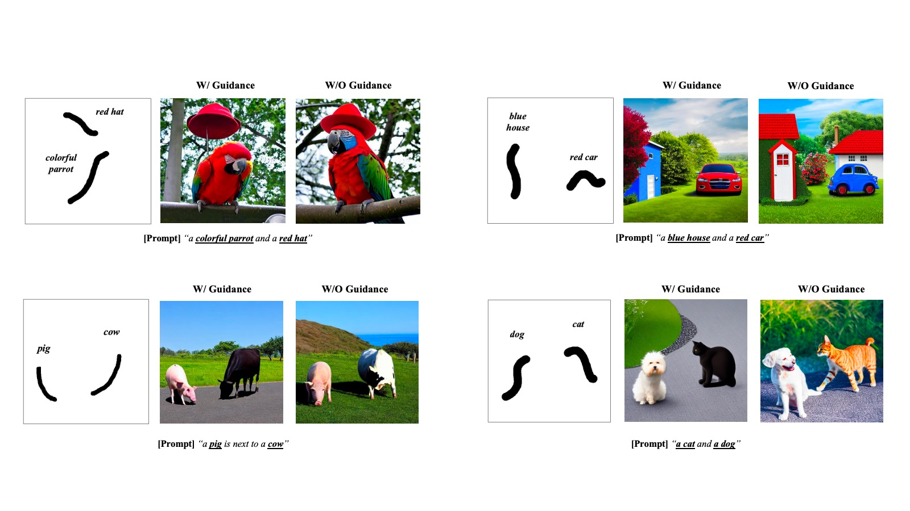
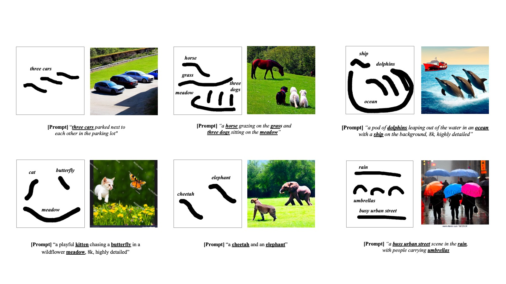
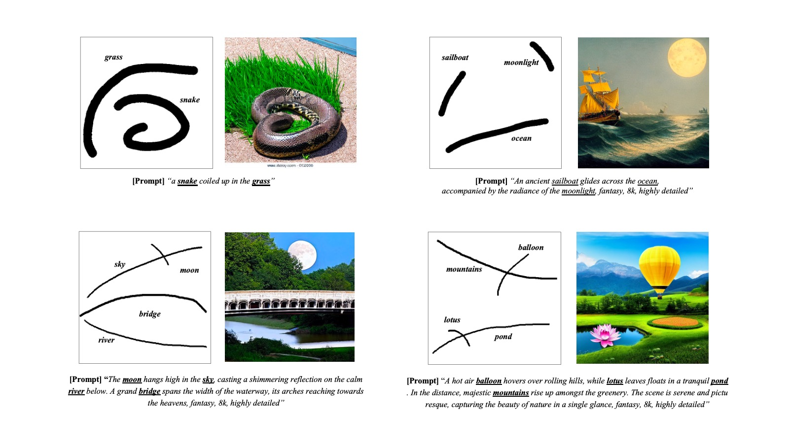

# Highlight-Guided Diffusion


Official implementation of **Highlight-Guided Diffusion: Scribble can be Good Guidance**

[](https://highlight-guided.io)
 [](#) 

<br/>


<br/>

<br/>

## Abstract


Diffusion models, particularly those like Stable Diffusion, have achieved notable success in text-to-image synthesis. Despite their success, aligning generated images with precise user intent remains a challenge, largely due to the abstract nature of text and its lack of spatial information. Traditional methods like bounding boxes and masks, used to guide the diffusion process, present their own limitations: bounding boxes fail to capture the complete shape and orientation of objects, whereas masks entail a high annotation cost.

In this research, we introduce 'Highlight-Guided Diffusion', a novel approach in scribble-based diffusion generation without additional fine-tuning. Our research focues on image synthesis with 'scribble', a concept related to annoation in weakly supervised semantic segmentation. We redefine a scribble as a 'highlight', a simple stroke that not only indicates the object's position and size but also conveys its abstract shape and direction. This approach aims to balance the spatial precision offered by masks with the simplicity of bounding boxes, facilitating a more intuitive and user-friendly approach to image synthesis.

Evaluations on the PASCAL-Scribble Dataset demonstrate the capability of our method to produce high-fidelity images closely aligned with user-provided highlights. In addition, we provide an accessible web application and a live demo that underscore this model's real-world applicability and user-friendliness.

<br/>


##  To Do


- [ ] Upload codes
- [ ] Release a paper


## Method


<br/>


## Results









<br/>

<br/>


## Setup
```bash
conda create --name highlight-guided python==3.8.0
conda activate highlight-guided
conda install pytorch torchvision torchaudio pytorch-cuda=11.7 -c pytorch -c nvidia
pip install -r environments/requirements.txt
pip install git+https://github.com/CompVis/taming-transformers.git
pip install git+https://github.com/openai/CLIP.git
```

Download the model [GLIGEN](https://huggingface.co/gligen/gligen-generation-text-box/blob/main/diffusion_pytorch_model.bin) trained with box-grounding tokens with text and put them in `checkpoints/gligen`


## Inference 

To draw a scribble for the guidance:
```bash
python draw_scribble.py
```

To run with user input text prompts:
```bash
python inference.py --ckpt checkpoints/gligen/text-box/diffusion_pytorch_model.bin
```


## Evaluation
Warming Up.


## Acknowledgments

This project is built on the following resources:

- [**Attention Refocusing**](https://github.com/Attention-Refocusing/attention-refocusing): This is the baseline model we used in our paper.

- [**GLIGEN**](https://github.com/gligen/GLIGEN): Our code is built upon the foundational work provided by GLIGEN. 


## Related Works


[BoxDiff: Text-to-Image Synthesis with Training-Free Box-Constrained Diffusion](https://github.com/showlab/BoxDiff)

[Dense Text-to-Image Generation with Attention Modulation](https://github.com/naver-ai/DenseDiffusion)

[Generative Data Augmentation Improves Scribble-supervised Semantic Segmentation](https://arxiv.org/abs/2311.17121v1)

[Grounded Text-to-Image Synthesis with Attention Refocusing](https://github.com/Attention-Refocusing/attention-refocusing)